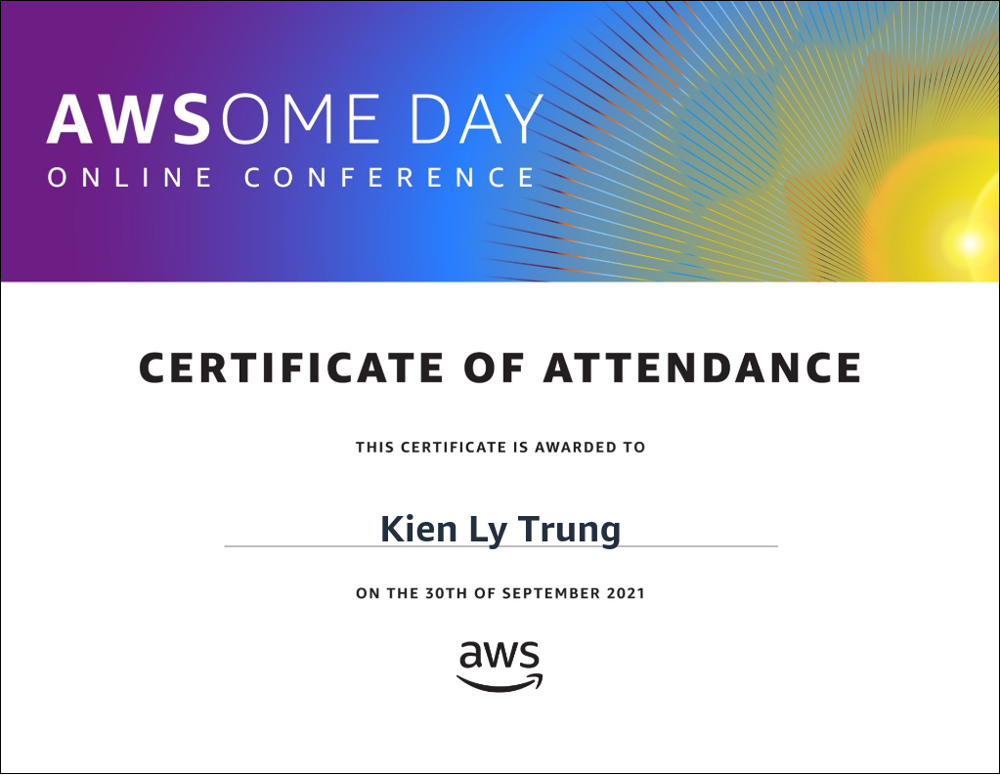

# AWSOME-DAY-ONLINE-CONFERENCE
Chương trình đào tạo của AWS  để giúp bạn bắt đầu hành trình đám mây

  

Có 5 modul
### Mô-đun 1: Giới thiệu về AWS 

[slide](https://asean-resources.awscloud.com/awsome-day-online-conference-on-demand-vietnamese/1-introduction-to-the-cloud-vn-21q3)

Học phần này bao gồm các chủ đề giới thiệu như đám mây là gì, lợi thế của điện toán đám mây, các mô hình triển khai đám mây và cơ sở hạ tầng toàn cầu AWS.

Speaker: Van Le, Territory Account Manager, AWS

### Mô-đun 2: Giới thiệu về các Dịch vụ AWS: Điện toán, Lưu trữ, Cơ sở dữ liệu

[slide](https://asean-resources.awscloud.com/awsome-day-online-conference-on-demand-vietnamese/2-introduction-to-aws-services-compute-storage-databases-vn-21q3)

Học phần này giới thiệu điện toán bằng cách so sánh khác biệt giữa máy chủ vật lý và máy chủ ảo cũng như nêu bật Amazon Elastic Compute Cloud (EC2). Học phần cũng sẽ đề cập đến lưu trữ và nhiều tùy chọn lưu trữ có thể mở rộng, bền lâu và tiết kiệm chi phí do AWS cung cấp. Nội dung tiếp theo là sức mạnh của cơ sở dữ liệu được xây dựng theo mục đích có sẵn thông qua AWS.

Speaker: Kathy Nguyen, Enterprise Sales Executive, AWS

### Mô-đun 3: Giới thiệu về các Dịch vụ AWS: Kết nối mạng, Bảo mật

[slide](https://asean-resources.awscloud.com/awsome-day-online-conference-on-demand-vietnamese/3-introduction-to-aws-services-networking-security-vn-21q3)

Học phần này giới thiệu về kết nối mạng, bao gồm Amazon Virtual Private Cloud và Elastic Load Balancing và bảo mật với AWS. Bảo mật là ưu tiên hàng đầu của AWS. Học phần cũng sẽ bao gồm Mô hình chia sẻ trách nhiệm, các dịch vụ của AWS được thiết kế để đảm bảo bảo mật với trạng thái sẵn có, được chứng nhận và tự động hóa cao.

Speaker: Hang Tran, Territory Account Manager, AWS

### Mô-đun 4: Đổi mới với AWS

[slide](https://asean-resources.awscloud.com/awsome-day-online-conference-on-demand-vietnamese/1-introduction-to-the-cloud-vn-21q3)

Học phần này đề cập đến nhiều cơ hội đổi mới thông qua các chủ đề như Machine Learning, IoT, Điện toán biên và nhiều chủ đề khác.

Speaker: Luc Tran, Territory Account Manager, AWS

### Mô-đun 5: Nhận xét kết thúc: Tóm tắt khóa học

[slide](https://asean-resources.awscloud.com/awsome-day-online-conference-on-demand-vietnamese/1-introduction-to-the-cloud-vn-21q3)

Nhận xét kết thúc bao gồm các tài nguyên sẽ đưa hành trình học tập của bạn lên cấp độ cao hơn và cách bắt đầu xây dựng trên AWS.

Speaker: Luc Tran, Territory Account Manager, AWS
